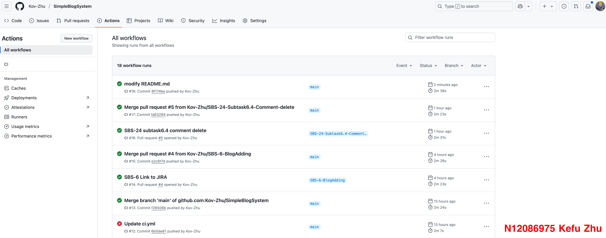
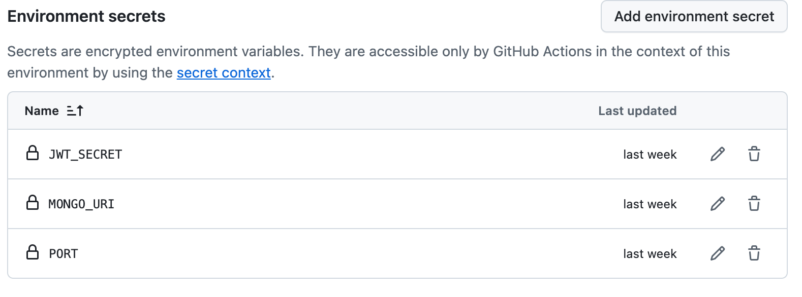

# IFN636 Assessment 1

N12086975 Kefu Zhu

[toc]

## 1. Jira

The  JIRA Project Board URL:

https://kovzhuu.atlassian.net/jira/software/projects/SBS/deployments?startDate=-3m&endDate=now&atlOrigin=eyJpIjoiMWNjZjBhMmM2MTIxNDlhOGEyNTY0NjU1ZjU5NjhmOWIiLCJwIjoiaiJ9

The Project Deployment URL:

http://13.211.56.43/login

### 1.1 User Stories

The first step of this project is define the user stories. In here I defined 6 user stories from login functions to blog functions.


### 1.2 Epic

To grouping the user stories, I create three epics to group them:


### 1.3 Subtasks

Then I created the detail subtasks of each user stories.


### 1.4 Assign tasks

In agile software development, each tasks will assign to different group menber. But in this project, just assign every task to myself.

After distributing the tasks, they need a timeline to know what should do and when is the due date.

JIRA Project Timeline:


### 1.5 Link to Github

To better collaborate between JIRA and Github, we can link the JIRA to Github:


### 1.6 JIRA Display

JIRA Project Summary:


JIRA Project Board:


## 2. SysML

The second part is **SysML diagram**.

Here we have 3 main functional requirements:

1. User signup and authentication
2. Blog management
3. Comment management

User authentication depends on user signup, and comment management depends on blog management.

The SysML is shown below:


## 3. Github Repository

Repo URL:

https://github.com/Kov-Zhu/SimpleBlogSystem


### 3.1 Branches

For each feature of the project, we should create a new branch to realize the corresponding functions.


### 3.2 Pull Requests

And after finishing one feature, we need do pull requests to review the code and merge it to the `main` branch.

Pull requests history:


### 3.3 Github Actions

The detail CI/CD explanation is in the Part 4.

Frist thing is to create a **new runner** using our AWS server.


After the configuration, the new runner will be shown in the `Self-hosted runners` section:


Then, during each pull to main actions or pull requests, CI/CD will automatically run in the AWS instance.

Github actions history:



### 3.4 Environment Control

In the Settings->Environment, we need to upload our security environment variables to Github so that Github Actions can work properly:



### 3.5 Version Control

Version control and deployment:


## 4. README.md

The README.md details can be found at `./README.md`

### 4.1 Project Setup Instruction

This is a Simple Blog System in which you can create blogs and leave comments.

#### 4.1.1 MongoDB

Before setting up the project, we need to create a MonoDB Cluster:


Then we need to connect to the Cluster.


Choose the drivers mode.


Keep this connection string, we will add it to `.env` file later.

Then create a database for our project `simple_blog_system`.


#### 4.1.2 AWS Instance

The second thing is to create a **AWS Instance**.


Then in the security setup page, we need open a port `5001` to 0.0.0.0/0 (every ip): 


`5001` is our backend port, this action is allowing accessing the backend api from everywhere.

Goto `./frontend/axiosConfig.jsx`, change the `baseURL` to the AWS instance public IP:

```jsx
import axios from 'axios';

const axiosInstance = axios.create({
  // baseURL: 'http://localhost:5001', // local
  baseURL: 'http://13.211.56.43:5001', // live
  headers: { 'Content-Type': 'application/json' },
});

export default axiosInstance;

```


#### 4.1.3 Project Setup

**To setup the project locally**:

1. Create `.env` file in `./backend` folder and filling them.

```sh
MONGO_URI=<MongoDB URL>
JWT_SECRET=<same as TaskManager project>
PORT=5001
```

2. Install all the dependence both for frontend and backend

Goto `./frontend` folder, run

```bash
npm install
```

Goto `./frontend` folder, run

```bash
npm install
```

3. If you want to run locally, goto `./frontend/axiosConfig.jsx` file, modify `baseURL`

```jsx
import axios from 'axios';

const axiosInstance = axios.create({
  baseURL: 'http://localhost:5001', // local !!Use this one
  // baseURL: 'http://13.211.56.43:5001', // live
  headers: { 'Content-Type': 'application/json' },
});

export default axiosInstance;
```

4. use `npm test` to run a test to check if all dependece are install correctly

   

5. `npm run dev` to run this project. Goto `http://localhost:3000/blogs` (local)

**To setup remotely**:

If run remotely, the CI/CD will automatically build the whole project and run the server.

To build remote manually:

First, clone the Github repo to remote server (AWS instance).

```bash
git clone https://github.com/Kov-Zhu/SimpleBlogSystem.git
```

Seceond, build the project.

 * Backend:

   1. Install all the dependence. Goto `./backend` run `npm install`
   2. Use pm2 to run the backend server `pm2 start "npm run start" --name "backend"`

 * Frontend:

   1. Install all the dependence. Goto `./frontend` run `npm install`
   2. Build the react project `npm run build`
   3. Use pm2 to run the frontend server `pm2 serve build/ 3000 --name "Frontend" --spa`

 * After that, run `pm2 status` to check if everything works properly:

   

### 4.2 CI/CD Pipline details

The CI/CD file:

```yml
name: CI

on:
    push:
        branches:
            - main
    pull_request:
        branches:
            - main
```

It **triggers** when:

* A **push** is made to the `main` branch.
* A **pull request** is opened against the `main` branch.

```yml
jobs:
    test:
        name: Run Tests
        runs-on: self-hosted
```

A job named "Run Tests" is defined.

It runs on a self-hosted runner, meaning it's not executed on GitHub's servers but on a custom server.

```yml
        strategy:
            matrix:
                node-version: [22] # Test on Node.js versions == 22
```

**Matrix strategy** allows testing on multiple Node.js versions.

Here, it's set to test **only Node.js v22**.

```yml
        environment: MONGO_URI
```

* Specifies that the `MONGO_URI` secret (MongoDB connection string) is needed for this job.

```yml
        steps:
        -   name: Checkout Code
            uses: actions/checkout@v3
```

* Uses `actions/checkout@v3` to fetch the repository code into the runner.

```yml
        -   name: Set up Node.js
            uses: actions/setup-node@v3
            with:
                node-version: ${{ matrix.node-version }}

```

* Uses `actions/setup-node@v3` to **install Node.js v22** (from the matrix configuration).

```yml
        -   name: Cache npm dependencies
            uses: actions/cache@v3
            with:
                path: ~/.npm
                key: ${{ runner.os }}-npm-${{ hashFiles('package-lock.json') }}
                restore-keys: |
                            ${{ runner.os }}-npm-
```

* Uses `actions/cache@v3` to **cache npm dependencies** to speed up future installs.
* It caches `~/.npm` based on the hash of `package-lock.json`.
* If an exact match isn’t found, it restores a previously cached version.

```yml
        -   name: Print Env Secret

            env:
                MONGO_URI: ${{ secrets.MONGO_URI }}
                JWT_SECRET: ${{ secrets.JWT_SECRET }}
                PORT: ${{ secrets.PORT }}
            run: | 
                echo "Secret 1 is: $MONGO_URI"
                echo "Secret 2 is: $JWT_SECRET"
                echo "Secret 3 is: $PORT"
```

* Retrieves **secrets** (`MONGO_URI`, `JWT_SECRET`, `PORT`) from GitHub's secret storage.

```yml
         -   run: pm2 stop all
```

* Stops all currently running **PM2-managed** Node.js processes. This is becuase we will setup and rebuild the project later.

```yml
        # Install dependencies for backend
        -   name: Install Backend Dependencies
            working-directory: ./backend
            run: |
                node --version
                npm install -g yarn
                yarn install

        # Install dependencies for frontend
        -   name: Install Frontend Dependencies
            working-directory: ./frontend
            run: |
                df -h
                sudo rm -rf ./build
                yarn install
                yarn run build
```

* Use `yarn` to install all the dependence for backand and frontend
* `yarn build` to build the frontend `react` project

```yml
        # Run backend tests
        -   name: Run Backend Tests
            env:
                MONGO_URI: ${{ secrets.MONGO_URI }}
                JWT_SECRET: ${{ secrets.JWT_SECRET }}
                PORT: ${{ secrets.PORT }}
            working-directory: ./backend
            run: npm test
```

* run backend test defined in `./backend/test/blog.test.js`

```yml
        -   run: npm ci
        -   run: | 
                cd ./backend
                touch .env
                echo "${{ secrets.PROD }}" > .env
```

* Moves to `./backend`.

* Creates a `.env` file with production secrets.

```yml
        -   run: |
                pm2 list
                pm2 start all

        -   run: pm2 restart all
```

* Lists all PM2 processes (`pm2 list`).

* Starts all PM2-managed applications (`pm2 start all`).